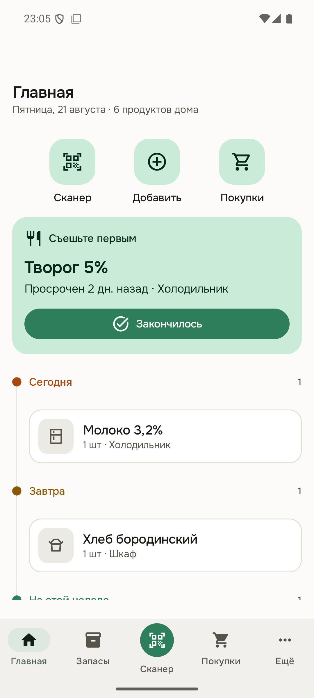
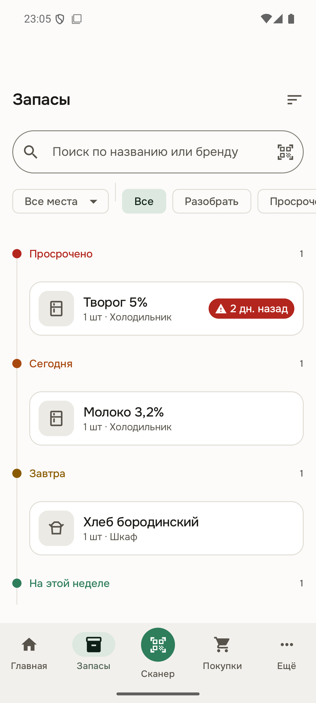
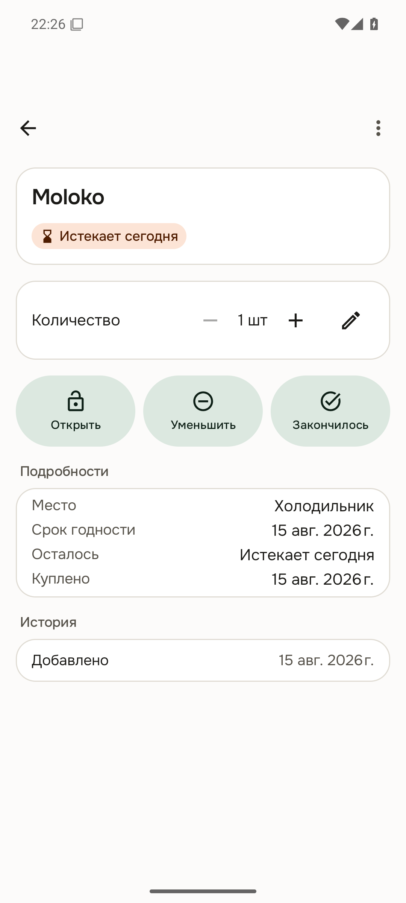
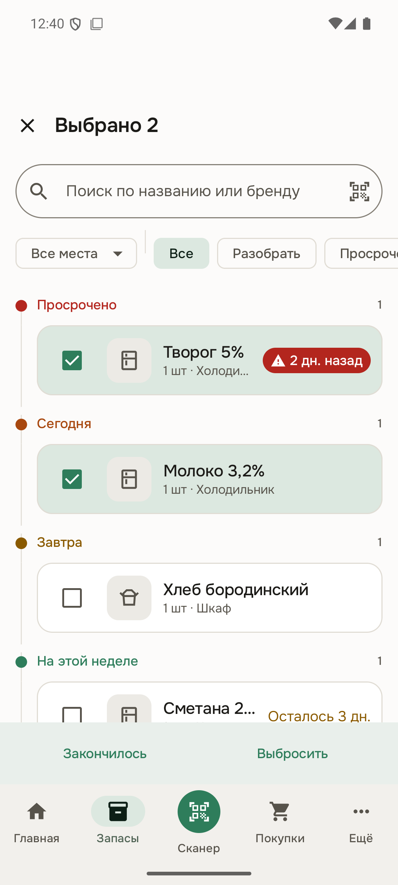
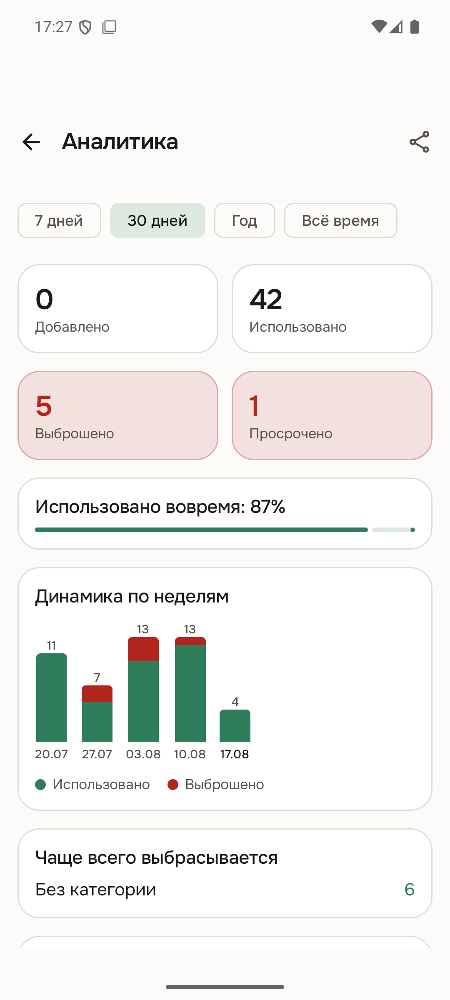
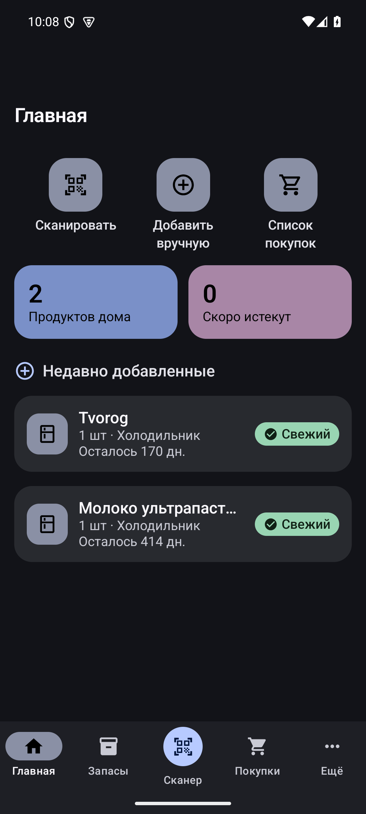
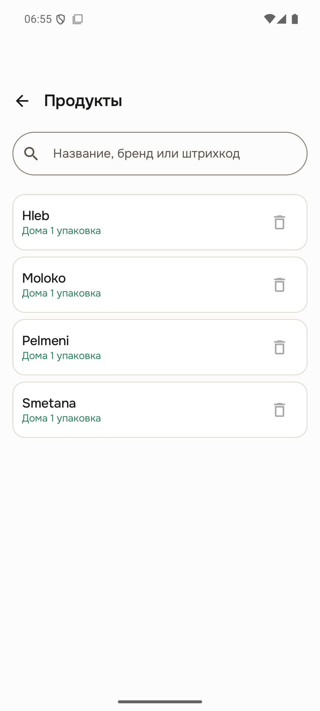

# EatBefore

[](https://github.com/Lucky2356/EatBefore/actions/workflows/ci.yml)
[](https://github.com/Lucky2356/EatBefore/releases/latest)
[](LICENSE)


Локальное Android-приложение для домашнего учёта продуктов: помогает помнить, что
есть дома, вовремя использовать продукты и меньше выбрасывать еду.

**[⬇ Скачать APK (последний релиз)](https://github.com/Lucky2356/EatBefore/releases/latest)**

| Главная | Запасы | Карточка продукта |
|---|---|---|
|  |  |  |

| Разбор пачками | Аналитика | Тёмная тема |
|---|---|---|
|  |  |  |

| Продукты |
|---|
|  |

> **Статус:** весь обязательный объём **P0 реализован и проверен на устройстве** —
> включая сканер (EAN/QR/DataMatrix и коды «Честного знака»), OCR срока, уведомления,
> список покупок, аналитику и резервное копирование
> (см. [ROADMAP.md](ROADMAP.md) и [PROJECT_STATE.md](PROJECT_STATE.md)).

## Возможности (реализовано в Foundation)

- Локальная база данных (Room) с разделением «карточка продукта» и «партия запаса».
- Несколько партий одного продукта с независимыми сроками и местами хранения.
- Ручное добавление продукта за пару касаний (быстрые пресеты срока годности).
- Главный экран: ближний горизонт по оси времени (просрочено, сегодня, завтра, на этой
  неделе), карточка «съешьте первым», общее количество, быстрые действия.
- Запасы: те же деления оси целиком, поиск (по названию/бренду/штрихкоду с debounce),
  фильтр по месту, сортировка.
- Карточка продукта: открыть, уменьшить, «закончилось», выбросить, переместить,
  изменить (название/бренд/категория/срок/заметка), фото товара из каталога.
- Свои места хранения: добавление, переименование, выбор основного, скрытие.
- Полная история всех действий; восстановление и отмена последнего действия.
- Предустановленные места хранения (холодильник, морозильник, шкаф, кладовая).
- **Сканер** штрихкодов/QR/DataMatrix (CameraX + ML Kit, on-device), фонарик, ручной ввод.
- **Поиск товара по коду** через Open Food Facts с локальным кешем (офлайн после первого раза).
- **OCR срока годности** по фото упаковки (ML Kit, on-device) с подтверждением пользователем.
- **Уведомления** о сроках (WorkManager): пакетное напоминание, настройки времени/дней/тихих часов.
- **Список покупок**: группировка по категориям, «купил → в запасы», предложение при списании.
- **«Честный знак» (GS1 DataMatrix)**: GTIN и срок годности извлекаются прямо из кода маркировки.
- **Аналитика и отчёты**: добавлено/использовано/выброшено/просрочено, «использовано
  вовремя», регулярные покупки, динамика по неделям, запасы по местам хранения,
  «Поделиться отчётом».
- **Резервное копирование**: экспорт/импорт JSON с версией схемы и проверкой целостности.
- **Продукты**: каталог карточек с поиском; лишнюю или ошибочную можно убрать — она
  перестаёт предлагаться, история сохраняется, а на втором телефоне продукт исчезает
  после ближайшего обмена.
- **Настройки** разложены по разделам (внешний вид, запасы, уведомления, данные, обмен,
  каталог, о приложении) и **ищутся** по названию, разделу и синонимам.
- **Обновление из самого приложения**: проверка нового релиза на GitHub раз в сутки по
  Wi-Fi и по кнопке, скачивание APK с прогрессом и установка — без браузера и файлового
  менеджера.
- Светлая/тёмная темы, динамические цвета (Android 12+), статус-бейджи (иконка+текст).
- Собственный визуальный язык: нейтральные поверхности с волосяными границами, шрифт
  Onest (кириллица нарисована в составе проекта), шкала громкости у состояний срока и
  движение — переходы между экранами, появление и уход строк в списках. Правила и причины —
  [ADR-0005](docs/adr/0005-visual-language.md).
- **Время — несущая ось списков**: и главная, и запасы выстроены вдоль одной линии —
  просрочено, сегодня, завтра, на этой неделе, позже. Место хранения при этом фильтр,
  а не способ группировки; карточка продукта показывает жизнь партии полосой от
  покупки до срока. Причины — [ADR-0006](docs/adr/0006-time-as-the-axis.md).
- Русский и английский интерфейс (по языку системы).
- Онбординг (3 экрана), empty/error/loading-состояния, undo через Snackbar.

## Технологический стек

Kotlin · Jetpack Compose · Material 3 · MVVM (однонаправленный UiState) ·
Room · Hilt · Coroutines/Flow · Navigation Compose · DataStore · WorkManager (задел) ·
Coil · Onest ([SIL OFL](app/src/main/assets/licenses/onest-ofl.txt)).
Готовые точки расширения: `ProductCatalogProvider` (внешний каталог),
`ExpiryDateOcrProvider` (OCR), CameraX + ML Kit (сканер) — в roadmap.

- **minSdk 26**, **targetSdk/compileSdk 36**, JVM target 17.
- Single-module (`:app`) с чётким пакетным разделением (core / domain / data / feature),
  готовым к последующему выделению модулей (см. [ARCHITECTURE.md](ARCHITECTURE.md)).

## Требования для сборки

- JDK 17+ (подходит JBR из состава Android Studio, JDK 21).
- Android SDK Platform 36 + build-tools (ставятся Android Studio).
- Файл `local.properties` с `sdk.dir` (создаётся автоматически Android Studio;
  в репозиторий **не** коммитится).

## Сборка и запуск

```bash
# Debug APK (результат: app/build/outputs/apk/debug/app-debug.apk)
./gradlew :app:assembleDebug

# Минифицированный release APK (R8). Подписывается вашим ключом, если он
# настроен, иначе debug-ключом с предупреждением — см. «Подпись релиза»
./gradlew :app:assembleRelease

# Установить на подключённое устройство/эмулятор
./gradlew :app:installDebug
# или
adb install -r app/build/outputs/apk/debug/app-debug.apk
```

На Windows без глобального Gradle можно указать JDK явно:

```bash
JAVA_HOME="/c/Program Files/Android/Android Studio/jbr" ./gradlew :app:assembleDebug
```

Проще всего открыть проект в Android Studio и нажать **Run**.

## Подпись релиза

Без настроенного ключа `assembleRelease` собирается **отладочной подписью** и
печатает предупреждение. Такой APK годится только для проверки на своём
устройстве: отладочный ключ общеизвестен, им подписаны сборки у всех.

### Создать свой ключ (один раз)

Ключ создаёте вы, и он не должен попадать в репозиторий. Пароль тоже
придумываете сами — ниже он показан как `ВАШ_ПАРОЛЬ`.

Глобальной Java в системе может не быть — `keytool` лежит внутри Android Studio.
В PowerShell путь с пробелами требует оператора `&`, а тильду keytool не
разворачивает, отсюда `$env:USERPROFILE`:

```powershell
& "C:\Program Files\Android\Android Studio\jbr\bin\keytool.exe" -genkeypair -v -keystore "$env:USERPROFILE\eatbefore-release.jks" -alias eatbefore -keyalg RSA -keysize 2048 -validity 10000
```

Организационные поля (подразделение, город, регион) можно пропустить Enter'ом —
для личного приложения они ни на что не влияют. На запрос пароля ключа
достаточно Enter: тогда он совпадёт с паролем хранилища.

Затем добавьте в `local.properties` (файл в `.gitignore`, в git не уходит):

```properties
release.storeFile=C\:/путь/к/eatbefore-release.jks
release.storePassword=ВАШ_ПАРОЛЬ
release.keyAlias=eatbefore
release.keyPassword=ВАШ_ПАРОЛЬ
```

Двоеточие диска экранируется (`C\:`) — это формат `.properties`, и lint
считает неэкранированное двоеточие ошибкой. Прямые слэши в пути работают и на
Windows.

В CI вместо файла работают переменные окружения `EATBEFORE_STORE_FILE`,
`EATBEFORE_STORE_PASSWORD`, `EATBEFORE_KEY_ALIAS`, `EATBEFORE_KEY_PASSWORD`.

Если пароль указан неверно, сборка **падает** с `KeytoolException` — тихого
отката на debug-ключ не происходит. Сообщение различает случаи: «не открылось
хранилище» — неверный `storePassword`, «Failed to read key … Get Key failed» —
неверный `keyPassword`.

**Храните `.jks` и пароль так же надёжно, как пароль от почты.** Потеряете —
обновить установленные копии приложения будет уже нечем: Android принимает
обновление, только если оно подписано тем же ключом.

Проверить, чем подписан собранный APK:

`apksigner` — это скрипт-обёртка, ему нужна Java в `JAVA_HOME`:

```bash
JAVA_HOME="C:/Program Files/Android/Android Studio/jbr" \
  "$ANDROID_HOME/build-tools/36.1.0/apksigner.bat" verify --print-certs \
  app/build/outputs/apk/release/app-release.apk
```

Должен показать ваш сертификат, а не `CN=Android Debug`. Схемы подписи — v2 и
v3 (v3 включена явно: только она позволяет в будущем сменить ключ без
переустановки).

### Разовый переход с отладочной подписи (обновление на 1.5.0)

Версии до 1.4.0 включительно подписаны отладочным ключом, 1.5.0 — настоящим.
Поставить 1.5.0 поверх такой копии **не получится**: Android принимает
обновление, только если оно подписано тем же ключом. А поскольку приложение не
участвует в системном бэкапе (`allowBackup=false`), простое удаление сотрёт
данные. Порядок такой:

1. В приложении: **Ещё → Настройки → Данные → Экспорт копии**, сохранить файл
   в надёжное место (не в память телефона, которую вы очистите).
2. Удалить приложение.
3. Установить APK, подписанный вашим ключом.
4. Пройти онбординг и в настройках выбрать **Импорт из файла**.

С версии 1.4.0 в копию попадают и настройки (тема, пороги, напоминания), так
что после импорта восстановится и они. Переход делается один раз: дальше ключ
не меняется, и обновления идут обычным порядком.

### Обновление

Приложение проверяет GitHub само — раз в сутки по Wi-Fi и по кнопке в
**Ещё → Настройки → О приложении**. Оттуда же оно скачивает APK и отдаёт его
системе, так что браузер и файловый менеджер не нужны.

Первый раз Android спросит дважды: сначала разрешить установку из этого
приложения (один раз на всю установку), затем подтвердить само обновление — пока
APK ставили руками, установщиком числится файловый менеджер. После первого
обновления через приложение установщиком становится оно само, и система может
обойтись без второго вопроса.

Скачивать по-прежнему можно и вручную — [страница релизов](https://github.com/Lucky2356/EatBefore/releases/latest)
никуда не делась.

## Тестирование

```bash
# Unit + интеграционные тесты (JVM, Robolectric) — use cases, Room, репозитории
./gradlew :app:testDebugUnitTest

# Инструментальные + UI-тесты 9 сценариев (требуют устройство/эмулятор).
# Внимание: после прогона приложение удаляется с устройства — переустановите APK.
./gradlew :app:connectedDebugAndroidTest

# Форматирование и статический анализ (выполняются и в CI)
./gradlew spotlessCheck detekt
./gradlew spotlessApply   # автоформатирование
```

Внешние сервисы в тестах заменяются fake-реализациями. Клок абстрагирован
(`AppClock`) для детерминированности.

## Структура проекта

```
app/src/main/java/com/eatbefore/
  core/common        — Result/валидация, AppClock, диспетчеры
  core/designsystem  — тема M3, статус-бейджи, общие компоненты, форматтеры
  core/database      — Room: entity, DAO, converters, миграции, seed
  core/datastore     — настройки (DataStore)
  domain             — модели, интерфейсы репозиториев/провайдеров, use cases (без Android)
  data               — реализации репозиториев, мапперы, fake-провайдеры
  feature/*          — onboarding, home, inventory, addmanual, product, history, placeholder
  navigation         — маршруты, нижняя навигация, NavHost
  di                 — Hilt-модули
  ui                 — корневой каркас приложения
```

## Ограничения текущего этапа

- Каталог Open Food Facts знает не все российские товары — для неизвестных кодов
  приложение предлагает ручное добавление с предзаполненным штрихкодом и сроком из кода.
- Совместный доступ для нескольких человек спроектирован, но не реализован —
  см. [ADR-0004](docs/adr/0004-household-sharing.md).
- Без настроенного keystore release-APK подписывается debug-ключом — годится
  только для проверки на своём устройстве (см. «Подпись релиза»).

## Документация

[ARCHITECTURE.md](ARCHITECTURE.md) · [ROADMAP.md](ROADMAP.md) ·
[PROJECT_STATE.md](PROJECT_STATE.md) · [THREAT_MODEL.md](THREAT_MODEL.md) ·
[PRIVACY.md](PRIVACY.md) · [PERFORMANCE.md](PERFORMANCE.md) · [TESTING.md](TESTING.md) ·
[CHANGELOG.md](CHANGELOG.md) · [TODO.md](TODO.md) · [ADR](docs/adr/)

## Конфиденциальность

Local-first, без регистрации, без рекламных SDK и трекеров. Подробнее — [PRIVACY.md](PRIVACY.md).

## Лицензия

[MIT](LICENSE).
